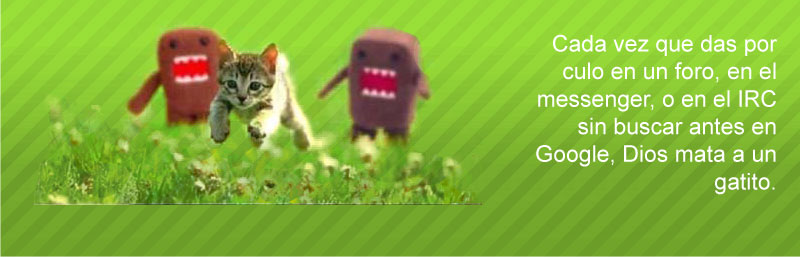

<html lang="es">
<head>
    <meta charset="UTF-8">
    <title>Random Image Search</title>
    
    
</head>
<body>
    

        

            
            

                

            

        

    

    <footer>
        

            <button class="image-button" onclick="setImage('gato')">domokun</button>
            <button class="image-button" onclick="setImage('carlos')">carlos I</button>
            <button class="image-button" onclick="setImage('claudio')">claudio</button>
            <button class="image-button" onclick="setImage('marlo')">marlo</button>
        

    </footer>

    
</body>
</html>